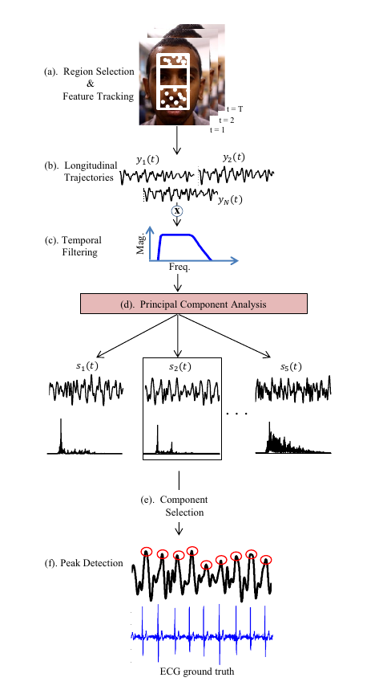

# Detecting Pulse from Head Motions in Video
This is the python implementation of this [paper](https://people.csail.mit.edu/mrub/vidmag/papers/Balakrishnan_Detecting_Pulse_from_2013_CVPR_paper.pdf)

## Explanation
This is abstract directly quated from paper
> We extract heart rate and beat lengths from videos by
measuring subtle head motion caused by the Newtonian
reaction to the influx of blood at each beat. Our method
tracks features on the head and performs principal compo-
nent analysis (PCA) to decompose their trajectories into a
set of component motions. It then chooses the component
that best corresponds to heartbeats based on its temporal
frequency spectrum. Finally, we analyze the motion pro-
jected to this component and identify peaks of the trajecto-
ries, which correspond to heartbeats. When evaluated on
18 subjects, our approach reported heart rates nearly iden-
tical to an electrocardiogram device. Additionally we were
able to capture clinically relevant information about heart
rate variability.




## Warning
Base of this implementation is made in 3 days for a hackathon, so there are still plenty of bugs and ugly fixes

__Sampling Frequency__ or __FPS__ for video is important for getting accurate results from FFT and Bandpass filter

All push requests and questions are welcome

# Usage

For using algorithm on paper
```bash
python main.py --graph 
```
same as
```bash
python main.py -c 0 --face_detector haar --graph 
```

If you want use __improved version__ with face landmarks:
```
python main.py --face_detector face_shape
```

If you want to use video file instead
```
python main.py -f path
```

If you want to test modules:
```
python modules/face.py
python modules/tracking.py
```

# Project Structure

Project consists of 3 modules for now:

* Face - FacePoints
* tracking - TrackPoints
* signal_processing - SignalProcess

```bash
├── main.py
├── modules
│   ├── face.py
│   ├── signal_processing.py
│   └── tracking.py
├── papers
│   ├── Balakrishnan_Detecting_Pulse_from_2013_CVPR_paper.pdf
│   ├── electronics-08-00663.pdf
├── README.md
├── requirements.txt
├── tests
│   ├── common.py
│   ├── dlib_dedect.py
│   ├── fft.ipynb
│   ├── lk_track.py
│   ├── signal_pross.ipynb
│   └── vid_test.py
├── data
│   ├── haarcascade
│   │   ├── ***
│   └── shape_predictor_68_face_landmarks.dat


```

## __FacePoints__
This modules is for detecting face and getting trackable points on face. You can select detector with *dedector_type* argument

  1.  __haar__ 
   * OpenCV's Haar face detection, gets face rectangle and rescales, then removes eyes from area. 
   * Finds optically trackable points in that filtered area
   * Fastest one
  2.  __dlib__
   * Same as Haar, but this time uses Dlib's face dedection for rectangle
   * More accurate
  3.  __face_shape__
   * Finds 68 face landmarks on face. Then removes eyes and mount landmark points for getting more stabilized data

## __TrackPoints__
This module is responsible for tracking points throughout video
Takes
`face_dedector, max_trace_num=150, max_trace_history=60` as input

__Face_dedector__ is __FacePoints__ class

If `Haar` or `Dlib` is used on face detection then tracker checks every point with backtracking, if a point is not consistent with forward and backtracking, then trace is marked as faulty and deleted.

On every update non-faulty traces are counted. 
If number their is not equal to `max_trace_num` then new trackable points are requested from `face_detector`.
Higher the trace number, higher the CPU need

If `face_shape` is used on face detection, then initial landmark points are tracked again with optical flow. 
If a point on face landmarks marked as faulty then face landmarks are requested from `face_detector` but only faulty points are replaced 

Because face landmarks only gives out integer coordinates, not using optical flow will result losing details.
Opticalflow tracks points on subpixel level and returns float.


## __SignalProcess__
This module is responsible for detecting heart beat from tracked signals.

First only Y components are selected from tracked traces and then filtered  with 5th order butterworth bandpass filter to get only frequencies between [0.75Hz, 3Hz] -> (45bpm, 180bpm)

If `Haar` or `dlib` used as initial points, then PCA is used to change dimesion of traces down to 5.

Dominant Frequency is found for each 5 signals with FFT. Then one of those dominant frequencies is evaluated as most periodic with checking total spectral power accounted for by the dominant frequency


### __IF face_shape is used__
Instead of selecting indivitual traces with PCA, mean of traces are calculated with assumption that each landmark has equal movement.
Then dominant frequency is found by appliying FFT to mean signal

## TODO:
- [x] Make main with source selection and argument parsing
- [x] Make signal_processing a module
- [ ] Output BPM into a file
- [ ] Make plotting faster
- [ ] For much better signal processing, add timestamp to every points tracked location in __TrackPoints__
- [ ]  For live feed, first get real fps with calculating time between every frame, then use it as __sampling rate__